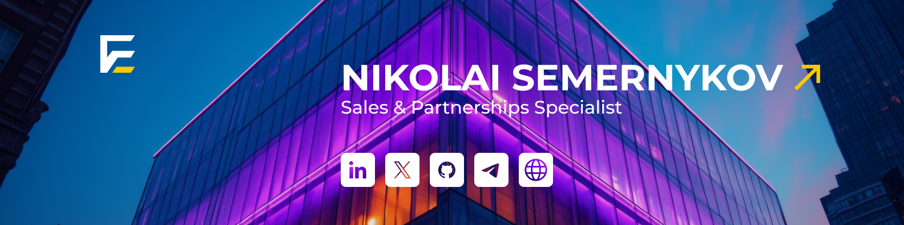

[**[Hire A Talent](https://tally.so/r/3lldZB)**]
[**[Request A Quote](https://tally.so/r/3lldZB)**]
[**[Find A Jobs](https://tally.so/r/3j9Qza)**] \_\_\_
[**[For Companies](https://tally.so/r/3lldZB)**]
[**[For Developers](https://tally.so/r/3j9Qza)**]

[**[Chat With Me](https://www.linkedin.com/in/nick-semernykov/)**]
[**[Work With Me](https://www.linkedin.com/in/nick-semernykov/)**]

# 💫 About Me:
🔭 Hi! I’m Nikolai 💻 Sales and Automation Specialist at Elevance IT 
🔥 Passionate about building seamless and efficient sales flow 
📫 Always open to connect and share ideas!
 

## 🌐 Socials:
  

# 💻 Tech Stack:
               
# 📊 GitHub Stats:
 
 

### ✍️ Random Dev Quote

### 🔝 Top Contributed Repo

---

  ## 💰 You can help me by Donating
   

  
<!-- Proudly created with GPRM ( https://gprm.itsvg.in ) -->
